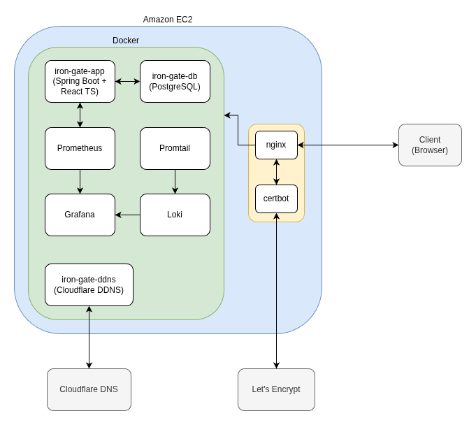

# Supply Chain Management System

## Overview
This is a simple, full-stack Supply Chain Management (SCM) system designed to manage warehouses, inventory, and logistics. Built with
**Java 21 (Spring Boot)** and **React 19 (TypeScript)**, it is a production-ready application deployed as a containerized environment
on **Amazon EC2**, including an observability stack.

## Key Features
### 1. Role-Based Access Control (RBAC)
Access to APIs and UI components is strictly governed by user roles:
- **Area Manager**: Full visibility and management of warehouses, stocks, and shipments.
- **Warehouse Manager**: Visibility on stock levels and initiates shipments specifically for their assigned warehouse.
- **Receiving Clerk**: Manages stock creation on warehouse level.
- **Driver**: Assigned to specific shipments; handles the transition from pickup to delivery completion.
### 2. Real-Time Dashboard
- Utilizes **Server-Sent Events (SSE)** to stream live updates to the frontend.
- Inventory fluctuations and shipment statuses are reflected on charts in real-time without manual refreshes.
### 3. Supply Chain Simulation
- **Shipment Lifecycle**: Implements the flow of moving stock between warehouses (Creation -> Driver Assignment -> Completion).
- **Automated Orders**: Includes a scheduler that generates customer orders, in order to be able to demonstrate stock allocation and fulfillment logic.
### 4. Enterprise Observability
- **Metrics**: Prometheus collects application-level metrics (JVM, Request latency, etc.) visualized via Grafana.
- **Logging**: Centralized log management using Loki and Promtail, allowing for efficient debugging across containers.

## Technical Stack
### Backend
- Java 21
- Spring Boot 3.4.13
- Spring SSE 6.2.15
- Hibernate 6.6.36
- PostgreSQL 14
- JUnit 5.12.2
- Gradle 9.2.1
- Flyway 11.19.1
### Frontend
- TypeScript 5.9.3
- React 19.2.0
- React Router DOM 7.11.0
- Recharts 3.6.0
- Vite 7.2.4
### Infrastructure
- Docker 28.2.2
- Amazon EC2
- Amazon EventBridge
- Cloudflare DDNS
### Monitoring
- Prometheus 3.8.1
- Promtail 2.9.2
- Loki 2.9.2
- Grafana 12.3.1
